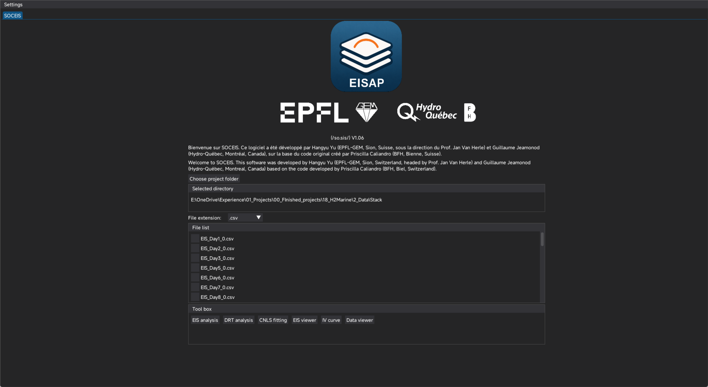

<p align="center">
  
</p>
<p align="center">
  
  
  
  
</p>

<h1 align="center">SOCEIS</h1>
<p align="center"><em>Suite for Operando Characterisation of Electrochemical Impedance Spectra</em></p>
<p align="center">
  <a href="https://pypi.org/project/soceis/"></a>
  <a href="https://pypi.org/project/soceis/"></a>
  
  
</p>

---

## Overview

**SOCEIS** is an open-source Python desktop application for the complete analysis workflow of Electrochemical Impedance Spectroscopy (EIS) data. It is developed at the Group of Energy Materials (GEM), École Polytechnique Fédérale de Lausanne (EPFL), Switzerland, in collaboration with Hydro-Québec and the Bern University of Applied Sciences (BFH).

The software integrates three tightly coupled analytical modules into a single graphical environment:

| Module | Function |
|--------|----------|
| **EIS** | Data import, quality screening, Kramers-Kronig validation, Z-HIT modulus reconstruction |
| **DRT** | Distribution of Relaxation Times inversion via Tikhonov regularisation and Radial Basis Functions |
| **CNLS** | Complex Nonlinear Least-Squares equivalent-circuit fitting with interactive model construction |

The graphical interface is built on [DearPyGui](https://github.com/hoffstadt/DearPyGui) and supports single-spectrum and batch (multi-file) workflows, making it suitable for both exploratory single-cell measurements and long-term degradation campaigns.

<p align="center">
  
</p>

---

## Installation

### Option 1 — pip (recommended)

Install the latest stable release directly from [PyPI](https://pypi.org/project/soceis/):

```bash
pip install soceis
```

Upgrade to a newer release at any time:

```bash
pip install --upgrade soceis
```

> **Tip:** It is recommended to install inside a dedicated virtual environment or conda environment to avoid dependency conflicts.
>
> ```bash
> conda create -n soceis python=3.11
> conda activate soceis
> pip install soceis
> ```

---

### Option 2 — from source (GitHub)

Clone the repository and run the launcher directly. This is useful for development or to access unreleased features:

```bash
# 1. Clone
git clone https://github.com/hangyu-yu/SOCEIS.git
cd SOCEIS

# 2. (Optional but recommended) create a virtual environment
conda create -n soceis python=3.11
conda activate soceis

# 3. Install dependencies manually
pip install -r src/GUI/requirements.txt

# 4. Launch
python SOCEIS.py
```

Missing dependencies are also detected and installed automatically on first launch.

To stay up to date with the latest commits:

```bash
git pull origin main
```

---

### Requirements

- Python ≥ 3.9 (64-bit)
- Key dependencies: `numpy`, `scipy`, `pandas`, `dearpygui`, `cvxopt`, `openpyxl`, `plotly`, `streamlit`

---

## Usage

### Launching SOCEIS

| Method | Command |
|--------|---------|
| pip install (any directory) | `soceis` |
| pip install (module syntax) | `python -m soceis` |
| Source clone | `python SOCEIS.py` |

### Workflow overview

1. **Open a project folder** — Use the *SOCEIS* home tab to select the directory containing your raw EIS data files. SOCEIS will scan for supported formats (`.mpt`, `.dta`, `.txt`, `.csv`) and populate the file list.

2. **EIS tab** — Configure preprocessing parameters (frequency cuts, significance threshold, outlier window) and run the pipeline. KK residuals and optional Z-HIT reconstruction are displayed immediately. Results are exported to `<project>/EIS/`.

3. **DRT tab** — Choose a spectral variant (truncated / KK-smooth / LC-corrected / extrapolated / Z-HIT), select the inversion method (Tikhonov or RBF), and set the regularisation parameter $\lambda$ manually or via automatic optimisation. DRT results are exported to `<project>/DRT/`.

4. **CNLS tab** — Assemble an equivalent-circuit model by adding elements from the menu (R, RC, RQ, G, fFLW, …), set parameter bounds, and run the L-BFGS-B fit. Individual element DRT contributions are computed post-fit. Results are exported to `<project>/CNLS/`.

5. **Single / All view** — Every tab provides a toggle between analysing a single selected file and overlaying all files in the project, enabling direct comparison across operating conditions or time steps.

### First run on Windows

On Windows, SOCEIS will offer to create a desktop shortcut the first time it starts. The shortcut invokes `python -m soceis` and includes the application icon automatically.

---

## Scientific Background and Implemented Methods

### 1. Data Import and Instrument Adaptation

SOCEIS provides dedicated file readers for the most common potentiostatic and galvanostatic frequency-response analysers:

| Instrument / Format | Extension(s) |
|---------------------|--------------|
| BioLogic EC-Lab | `.mpt` |
| Gamry Framework | `.dta` |
| Zahner Thales | `.txt`, `.csv` |
| Generic frequency-domain text | `.txt`, `.csv` |

All readers convert raw instrument data to a unified internal representation containing the frequency vector $f$ [Hz], the complex impedance $Z = Z' - jZ''$ [$\Omega \cdot \text{cm}^2$], and optional per-point significance scores. Area-specific impedance (ASR) normalisation is applied when the active cell area is provided.

**References:** [R1], [R2]

---

### 2. EIS Preprocessing Pipeline

Raw spectra are subjected to a configurable, sequential preprocessing chain before any model-based analysis:

1. **Frequency-range truncation** — upper and/or lower frequency limits are set manually or by significance threshold to discard artefact-prone extreme-frequency data.
2. **Significance-based filtering** — for instruments that report a per-point quality indicator (e.g., Zahner significance score), points below a user-defined threshold $\sigma_\text{min}$ are removed.
3. **Moving-window outlier rejection** — a sliding-window z-score algorithm identifies and removes isolated outlier points that deviate from local spectral trends.
4. **Manual point removal** — individual frequency points can be excluded through the GUI.
5. **Inductive / capacitive endpoint correction** — series inductance $L$ and parasitic capacitance $C$ contributions are estimated and subtracted to improve low-frequency DRT inversion quality.

**References:** [R1], [R2], [R3]

---

### 3. Kramers-Kronig Consistency Validation

The Kramers-Kronig (KK) relations are a pair of integral transforms that any linear, causal, and time-invariant impedance response must satisfy [R4]:

$$Z'(\omega) = Z'(\infty) + \frac{2}{\pi} \int_0^{\infty} \frac{\xi Z''(\xi) - \omega Z''(\omega)}{\xi^2 - \omega^2} \, \text{d}\xi$$

$$Z''(\omega) = -\frac{2\omega}{\pi} \int_0^{\infty} \frac{Z'(\xi) - Z'(\omega)}{\xi^2 - \omega^2} \, \text{d}\xi$$

SOCEIS implements the **linear KK test** of Boukamp [R5], which fits the measured spectrum with a Voigt circuit (series of $RC$ elements at logarithmically spaced time constants) whose elements automatically satisfy the KK relations. The fit residuals

$$\Delta_\text{re}(\omega_k) = \frac{Z'_\text{meas}(\omega_k) - Z'_\text{KK}(\omega_k)}{|Z_\text{meas}(\omega_k)|}, \quad \Delta_\text{im}(\omega_k) = \frac{Z''_\text{meas}(\omega_k) - Z''_\text{KK}(\omega_k)}{|Z_\text{meas}(\omega_k)|}$$

are displayed as a function of frequency. Points with $|\Delta| \gtrsim 0.5\%$ are flagged, and a residual-based automatic masking option is provided. Ohmic ($R_\Omega$) and polarisation ($R_\text{pol}$) resistances are extracted from the RC decomposition.

**References:** [R4], [R5], [R6]

---

### 4. Z-HIT Modulus Reconstruction

The Z-HIT algorithm [R7] reconstructs the impedance modulus from the phase angle alone, providing an independent validation channel that is particularly sensitive to instrumental drift and non-stationarity. The reconstruction is based on the approximate Hilbert-transform relation:

$$\ln|Z(\omega_0)| \approx C + \frac{2}{\pi} \int_{\omega_s}^{\omega_0} \varphi(\omega) \, \text{d}(\ln \omega) + \gamma \frac{\text{d}\varphi}{\text{d}\ln\omega}\bigg|_{\omega_0}$$

where $\gamma = -\pi/6$ is the exact correction factor derived from the Riemann zeta function, and $C$ is a scalar constant fitted by least-squares to the measured modulus. The phase $\varphi(\omega)$ is first smoothed with a **Savitzky-Golay filter** [R8] of user-configurable polynomial order and window width before numerical integration (trapezoidal rule). The log residual

$$\delta_{\ln Z}(\omega_k) = \ln|Z_\text{meas}(\omega_k)| - \ln|Z_\text{Z-HIT}(\omega_k)|$$

is plotted against frequency. Non-zero residuals indicate relaxation phenomena outside the measured frequency window, instrument artefacts, or non-stationarity. Z-HIT-reconstructed spectra can optionally be fed into the subsequent DRT analysis in place of the raw data.

**References:** [R7], [R8]

---

### 5. Distribution of Relaxation Times (DRT)

The DRT transforms the impedance spectrum into a distribution function $\gamma(\tau)$ defined by:

$$Z(\omega) = R_\Omega + \int_0^{\infty} \frac{\gamma(\tau)}{1 + j\omega\tau} \, \text{d} \tau$$

where $\tau = RC$ is the relaxation time. Peaks in $\gamma(\tau)$ correspond to distinct electrochemical sub-processes, enabling physically interpretable process separation without assumptions about the circuit topology.

SOCEIS provides **two independent DRT inversion methods**:

#### 5a. Tikhonov Regularisation

The discretised linear system $\mathbf{A}\mathbf{g} = \mathbf{Z}$ is solved with Tikhonov regularisation [R9]:

$$\hat{\mathbf{g}} = \arg\min_{\mathbf{g} \geq 0} \left\| \mathbf{A}\mathbf{g} - \mathbf{Z} \right\|_2^2 + \lambda \left\| \mathbf{L}\mathbf{g} \right\|_2^2$$

where $\lambda$ is the regularisation parameter, $\mathbf{L}$ is a finite-difference derivative matrix (1st or 2nd order), and the non-negativity constraint ($\mathbf{g} \geq 0$) is enforced by Non-Negative Least Squares (NNLS). The real-part-only and imaginary-part-only formulations [R3] are computed separately, allowing cross-validation. Inversion is performed on five spectral variants: the preprocessed truncated spectrum, the KK-smoothed spectrum, the LC-corrected spectrum, the low-frequency-extrapolated spectrum, and (optionally) the Z-HIT-reconstructed spectrum.

**Regularisation parameter selection** is available in three modes:

| Mode | Method |
|------|--------|
| Manual | Fixed $\lambda$ set by user |
| Optimal | Golden-section search minimising a discrepancy-principle criterion over $[\lambda_\text{min},\, \lambda_\text{max}]$ |
| Re/Im cross-validation | Minimises the deviation between Re-only and Im-only DRT solutions |

#### 5b. Radial Basis Function (RBF) DRT

The RBF method [R10] expands $\gamma(\tau)$ in a set of radial basis functions centred at $M$ logarithmically spaced collocation points $\{\tau_m\}$:

$$\gamma(\tau) = \sum_{m=1}^{M} c_m \, \phi\left(\frac{\ln \tau - \ln \tau_m}{\varepsilon}\right)$$

The coefficient vector $\mathbf{c}$ is determined by solving a regularised linear system assembled from the inner products of the basis functions with the impedance kernel. The shape parameter $\varepsilon$ controls the width of each basis function. This formulation naturally enforces smooth solutions and imposes non-negativity through constrained optimisation (`cvxopt` QP solver).

**References:** [R3], [R9], [R10], [R11]

<p align="center">
  
</p>

---

### 6. Complex Nonlinear Least-Squares Equivalent-Circuit Fitting (CNLS)

CNLS fitting optimises the parameters $\boldsymbol{\theta}$ of a user-defined equivalent circuit model $Z_\text{model}(\omega, \boldsymbol{\theta})$ by minimising the weighted residual sum of squares:

$$\min_{\boldsymbol{\theta}} \sum_{k=1}^{N} w_k \left[ \left( Z'_\text{meas}(\omega_k) - Z'_\text{model}(\omega_k, \boldsymbol{\theta}) \right)^2 + \left( Z''_\text{meas}(\omega_k) - Z''_\text{model}(\omega_k, \boldsymbol{\theta}) \right)^2 \right]$$

The optimisation is performed with `scipy.optimize.minimize` using the L-BFGS-B algorithm, which supports box constraints $\boldsymbol{\theta}_\text{lb} \leq \boldsymbol{\theta} \leq \boldsymbol{\theta}_\text{ub}$ and segment-level percentage constraints on resistive and time-constant parameters.

#### Available circuit elements

| Symbol | Element | Impedance |
|--------|---------|-----------|
| R | Resistor | $Z = R$ |
| L | Inductor | $Z = j\omega L$ |
| C | Capacitor | $Z = 1/(j\omega C)$ |
| Q | Constant Phase Element | $Z = 1/(Q(j\omega)^n)$ |
| RC | RC parallel | $Z = R/(1+j\omega RC)$ |
| RQ | Randles (R∥Q) | $Z = R/(1+R \cdot Q(j\omega)^n)$ |
| G | Gerischer | $Z = R_G/\sqrt{1+j\omega\tau_G}$ |
| fFLW | Finite-length Warburg | $Z = R_W \tanh(\sqrt{j\omega\tau_W})/\sqrt{j\omega\tau_W}$ |
| FLW | Semi-infinite Warburg | $Z = \sigma(1-j)/\sqrt{\omega}$ |
| RandleC / RandleCPE | Randle circuits | Combined diffusion + kinetics |

#### CNLS workflow

1. **Model construction** — elements are added interactively via the GUI menu; the circuit string is parsed into an impedance tree.
2. **Reference data selection** — fitting can be performed against any of the five spectral variants produced by the EIS preprocessing (truncated, KK-smooth, DRT-smooth, LC-corrected, extrapolated) or against the Z-HIT reconstruction.
3. **Parameter initialisation** — initial guesses are populated from DRT time-constant peak positions (when available) or set manually.
4. **Fit execution** — bounded CNLS optimisation is run; results are overlaid on the Nyquist and Bode plots.
5. **DRT verification** — post-fit, the individual element contributions and the total model are passed through the same DRT inversion to verify sub-process attribution.

**References:** [R12], [R13], [R14], [R15]

<p align="center">
  
</p>

---

### 7. Batch Analysis and Project Management

All three analytical modules support **single-file** and **all-files** views on project folders containing arbitrarily large collections of EIS spectra (e.g., hourly measurements over multi-thousand-hour durability campaigns). Processed results are persisted to instrument-specific sub-folders (`EIS/`, `DRT/`, `CNLS/`) as Excel workbooks, enabling incremental re-loading on subsequent sessions without recomputation.

<p align="center">
  
</p>

---

## Repository Structure

```
SOCEIS/
├── SOCEIS.py                  # Legacy entry point (source-tree launch)
├── soceis/                    # Installable package (pip)
│   ├── __init__.py
│   ├── __main__.py            # `python -m soceis` / `soceis` CLI entry point
│   └── assets/                # Fonts, icons, images
├── src/
│   ├── GUI/                   # DearPyGui interface (tabs, callbacks, plotting)
│   │   ├── gui_main.py
│   │   ├── gui_tab_soceis.py
│   │   ├── gui_tab_eis.py
│   │   ├── gui_tab_drt.py
│   │   ├── gui_tab_cnls.py
│   │   └── Utils/             # File lists, progress modals, plot helpers
│   ├── Methods/
│   │   ├── DRT/               # EIS class, KK, Z-HIT, Tikhonov, RBF
│   │   └── CNLS/              # Circuit class, element library, CNLS solver
│   └── Functions/
│       └── 01_Data_read/      # Instrument-specific file readers
└── pyproject.toml
```

---

## Citing SOCEIS

If SOCEIS contributes to published research, please cite the following papers:

> **Caliandro, P., Nakajo, A., Diethelm, S., & Van herle, J.** (2019).
> *Model-assisted identification of solid oxide cell elementary processes by electrochemical impedance spectroscopy measurements.*
> *Journal of Power Sources*, **436**, 226838.
> https://doi.org/10.1016/j.jpowsour.2019.226838

> **Yu, H., Frantz, C., Savioz, L., Aubin, P., Fronterotta, D., Geipel, C., Moussaoui, H., Jeanmonod, G., Wang, L., & Van herle, J.** (2025).
> *Poisoning and recovery behavior of Ni-GDC based electrolyte-supported solid oxide fuel cell exposed to common sulfur compounds under processed biogas environment.*
> *Journal of Power Sources*, **642**, 236901.
> https://doi.org/10.1016/j.jpowsour.2025.236901

---

### BibTeX

```bibtex
@article{caliandroModelassistedIdentificationSolid2019,
  title = {Model-Assisted Identification of Solid Oxide Cell Elementary Processes by Electrochemical Impedance Spectroscopy Measurements},
  author = {Caliandro, P. and Nakajo, A. and Diethelm, S. and {Van herle}, J.},
  year = {2019},
  month = oct,
  journal = {Journal of Power Sources},
  volume = {436},
  pages = {226838},
  issn = {0378-7753},
  doi = {10.1016/j.jpowsour.2019.226838},
  urldate = {2022-06-24},
  lccn = {2}
}

@article{yuPoisoningRecoveryBehavior2025,
  title = {Poisoning and Recovery Behavior of {{Ni-GDC}} Based Electrolyte-Supported Solid Oxide Fuel Cell Exposed to Common Sulfur Compounds under Processed Biogas Environment},
  author = {Yu, Hangyu and Frantz, C{\'e}dric and Savioz, Louis and Aubin, Philippe and Fronterotta, Dante and Geipel, Christian and Moussaoui, Hamza and Jeanmonod, Guillaume and Wang, Ligang and {Van herle}, Jan},
  year = {2025},
  month = jun,
  journal = {Journal of Power Sources},
  volume = {642},
  pages = {236901},
  issn = {0378-7753},
  doi = {10.1016/j.jpowsour.2025.236901},
  urldate = {2025-04-13},
  lccn = {3}
}
```

---

## Method References

- **[R1]** Orazem, M. E., & Tribollet, B. (2017). *Electrochemical Impedance Spectroscopy* (2nd ed.). Wiley.
- **[R2]** Lasia, A. (2014). *Electrochemical Impedance Spectroscopy and its Applications*. Springer.
- **[R3]** Wan, T. H., Saccoccio, M., Chen, C., & Ciucci, F. (2015). Influence of the discretization methods on the distribution of relaxation times deconvolution: implementing radial basis functions with DRTtools. *Electrochimica Acta*, **184**, 483–499. https://doi.org/10.1016/j.electacta.2015.09.097
- **[R4]** Kramers, H. A. (1927). La diffusion de la lumière par les atomes. *Atti del Congresso Internazionale dei Fisici*, **2**, 545–557. | Kronig, R. de L. (1926). On the theory of dispersion of X-rays. *Journal of the Optical Society of America*, **12**(6), 547–557.
- **[R5]** Boukamp, B. A. (1995). A linear Kronig-Kramers transform test for immittance data validation. *Journal of The Electrochemical Society*, **142**(6), 1885–1894. https://doi.org/10.1149/1.2044210
- **[R6]** Schönleber, M., Klotz, D., & Ivers-Tiffée, E. (2014). A method for improving the robustness of linear Kramers-Kronig validity tests. *Electrochimica Acta*, **131**, 20–27. https://doi.org/10.1016/j.electacta.2014.01.034
- **[R7]** Ehm, W., Göhr, H., Kaus, R., Röseler, B., & Schiller, C. A. (2000). The evaluation of electrochemical impedance spectra using the Z-HIT algorithm. *ACH-Models in Chemistry*, **137**(2–3), 145–157.
- **[R8]** Savitzky, A., & Golay, M. J. E. (1964). Smoothing and differentiation of data by simplified least squares procedures. *Analytical Chemistry*, **36**(8), 1627–1639. https://doi.org/10.1021/ac60214a047
- **[R9]** Tikhonov, A. N., & Arsenin, V. Y. (1977). *Solutions of Ill-Posed Problems*. Winston & Sons.
- **[R10]** Ciucci, F., & Chen, C. (2015). Analysis of electrochemical impedance spectroscopy data using the distribution of relaxation times: a Bayesian and hierarchical Bayesian approach. *Electrochimica Acta*, **167**, 439–454. https://doi.org/10.1016/j.electacta.2015.03.123
- **[R11]** Effat, M. B., & Ciucci, F. (2017). Bayesian and hierarchical Bayesian based regularization for deconvolving the distribution of relaxation times from electrochemical impedance spectroscopy data. *Electrochimica Acta*, **247**, 1117–1129. https://doi.org/10.1016/j.electacta.2017.07.050
- **[R12]** Levenberg, K. (1944). A method for the solution of certain non-linear problems in least squares. *Quarterly of Applied Mathematics*, **2**(2), 164–168.
- **[R13]** Marquardt, D. W. (1963). An algorithm for least-squares estimation of nonlinear parameters. *SIAM Journal on Applied Mathematics*, **11**(2), 431–441.
- **[R14]** Boukamp, B. A. (1986). A nonlinear least squares fit procedure for analysis of immittance data of electrochemical systems. *Solid State Ionics*, **20**(1), 31–44. https://doi.org/10.1016/0167-2738(86)90031-7
- **[R15]** Caliandro, P., Nakajo, A., Diethelm, S., & Van herle, J. (2019). Model-assisted identification of solid oxide cell elementary processes by electrochemical impedance spectroscopy measurements. *Journal of Power Sources*, **436**, 226838. https://doi.org/10.1016/j.jpowsour.2019.226838

---

## Changelog

### v1.0.5 (2026-03-27)
- Pip-installable package (`pip install soceis`; `soceis` CLI command)
- Windows first-run desktop shortcut creation
- Unified proportional layout for error/warning modal dialogs
- Post-import warning suppression for default/unpopulated project directories
- Bug fix: missing `if __name__ == '__main__'` guard in `SOCEIS.py`

### v1.04
- Proportional progress, error, and warning modal windows
- Bug fix: CNLS tab crash when no EIS processed data is available
- Bug fix: display-file dropdown de-sync across tabs

### v1.03
- DRT Tools integration and lambda visualisation
- Z-HIT smoothing and DRT pipeline integration

### v0.2 (2025-05-07)
- First public beta: complete EIS, DRT, and CNLS fitting functionalities

---

## License

This project is licensed under the terms specified in [LICENSE](LICENSE).

