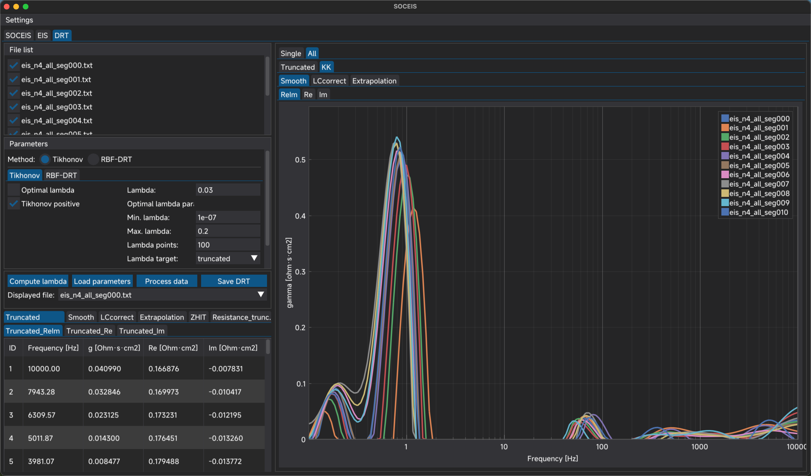
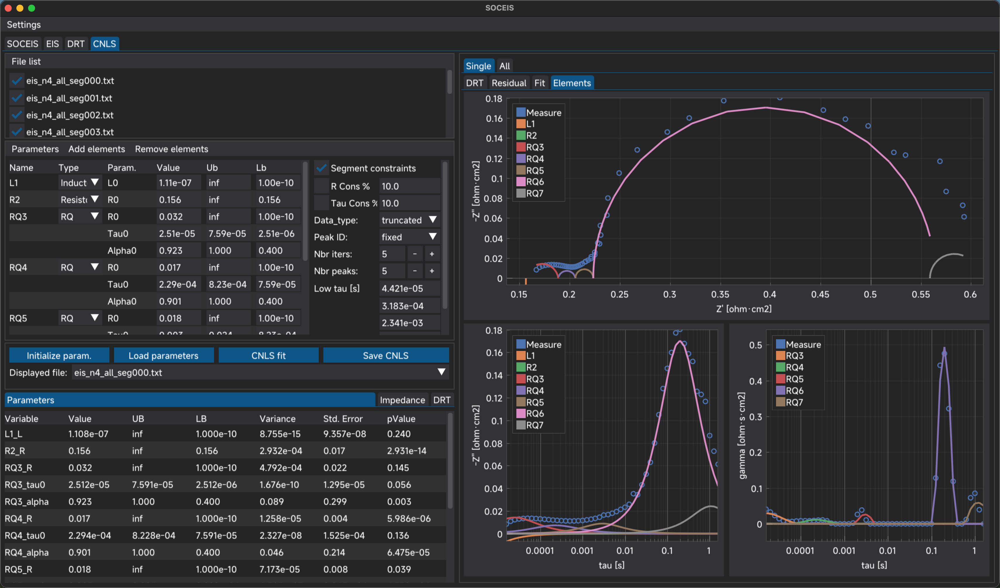
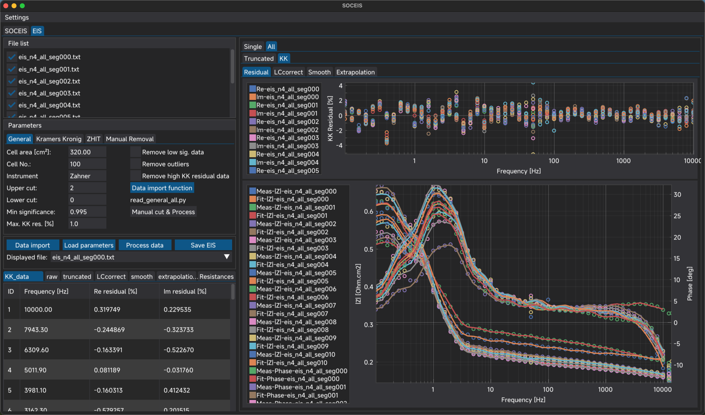

<p align="center">
  
</p>
<p align="center">
  
  
  
  
</p>

<h1 align="center">EISAP</h1>
<p align="center"><em>Electrochemical Impedance Spectroscopy Analysis Program</em></p>
<p align="center"><sub>formerly <strong>SOCEIS</strong> — Suite for Operando Characterisation of Electrochemical Impedance Spectra</sub></p>
<p align="center">
  <a href="https://pypi.org/project/eisap/"></a>
  <a href="https://pypi.org/project/eisap/"></a>
  
</p>

---

## Overview

**EISAP** (alias **SOCEIS**) is an open-source Python desktop application for the complete analysis workflow of Electrochemical Impedance Spectroscopy (EIS) data. It is developed by Dr. Hangyu Yu at the Group of Energy Materials (GEM), École Polytechnique Fédérale de Lausanne (EPFL), Switzerland, in collaboration with Hydro-Québec and the Bern University of Applied Sciences (BFH).

The software integrates three tightly coupled analytical modules into a single graphical environment:

| Module | Function |
|--------|----------|
| **EIS** | Data import, quality screening, Kramers-Kronig validation, Z-HIT modulus reconstruction |
| **DRT** | Distribution of Relaxation Times inversion via Tikhonov regularisation and Radial Basis Functions |
| **CNLS** | Complex Nonlinear Least-Squares equivalent-circuit fitting with interactive model construction |

The graphical interface is built on [DearPyGui](https://github.com/hoffstadt/DearPyGui) and supports single-spectrum and batch (multi-file) workflows, making it suitable for both exploratory single-cell measurements and long-term degradation campaigns.


---

## Installation

### Option 1 — pip (recommended)

Install the latest stable release directly from [PyPI](https://pypi.org/project/eisap/):

```bash
pip install eisap
```

Upgrade to a newer release at any time:

```bash
pip install --upgrade eisap
```

> **Tip:** It is recommended to install inside a dedicated virtual environment or conda environment to avoid dependency conflicts.
>
> ```bash
> conda create -n eisap python=3.11
> conda activate eisap
> pip install eisap
> ```

---

### Option 2 — from source (GitHub)

Clone the repository and run the launcher directly. This is useful for development or to access unreleased features:

```bash
# 1. Clone
git clone https://github.com/hangyu-yu/eisap.git
cd SOCEIS

# 2. (Optional but recommended) create a virtual environment
conda create -n eisap python=3.11
conda activate eisap

# 3. Install dependencies manually
pip install -r src/GUI/requirements.txt

# 4. Launch
python EISAP.py
```

Missing dependencies are also detected and installed automatically on first launch.

To stay up to date with the latest commits:

```bash
git pull origin main
```

---

### Option 3 — download ZIP and double-click (simplest, no Git required)

This is the quickest way to get EISAP running without any command-line tools.

**Step 1 — Install Python**

Download and install Python 3.11 (64-bit) from https://www.python.org/downloads/

> **Important (Windows):** During installation, check **"Add Python to PATH"** before clicking Install. Without this, double-clicking `EISAP.py` will not work.

**Step 2 — Download EISAP**

Go to the [SOCEIS GitHub page](https://github.com/hangyu-yu/eisap), click the green **Code** button, then select **Download ZIP**. Extract the ZIP archive to any folder on your computer.

**Step 3 — Run EISAP**

Open the extracted folder and **double-click `EISAP.py`**. On first launch, missing dependencies are detected and installed automatically. Once finished, the EISAP window will open.

> If double-clicking opens a text editor instead of running the script, right-click `EISAP.py` → **Open with** → **Python**.

---

### Requirements

- Python ≥ 3.9 (64-bit)
- Key dependencies: `numpy`, `scipy`, `pandas`, `dearpygui`, `cvxopt`, `openpyxl`, `plotly`, `streamlit`

---

## Beginner's Guide (No prior Python experience needed)

This section walks you through everything from zero to running EISAP with a double-click.

**Step 1 — Install Python**

Download and install Python 3.11 from the official website: https://www.python.org/downloads/

> During installation on Windows, check the box **"Add Python to PATH"** before clicking Install.

**Step 2 — Install EISAP**

Open a terminal (Windows: press `Win+R`, type `cmd`, press Enter) and run:

```
pip install eisap
```

This automatically downloads EISAP and all its dependencies. Wait for it to finish.

**Step 3 — Create a desktop shortcut (Windows)**

In the same terminal, run:

```
eisap
```

EISAP will start and offer to create a desktop shortcut automatically. Click **Yes**. After that you can launch EISAP at any time by **double-clicking the desktop icon** — no terminal needed.

**Step 4 — Launch EISAP**

- **Windows:** double-click the `SOCEIS` desktop shortcut created in Step 3.
- **macOS / Linux:** open a terminal and type `eisap`, then press Enter.

> If you ever need to update to a newer version, run `pip install --upgrade eisap` in a terminal.

---

## Usage

### Launching EISAP

| Method | Command |
|--------|---------|
| pip install (any directory) | `eisap` |
| pip install (module syntax) | `python -m eisap` |
| Source clone | `python EISAP.py` |

### Workflow overview

1. **Open a project folder** — Use the *EISAP* home tab to select the directory containing your raw EIS data files. EISAP will scan for supported formats (`.mpt`, `.dta`, `.txt`, `.csv`) and populate the file list.

2. **EIS tab** — Configure preprocessing parameters (frequency cuts, significance threshold, outlier window) and run the pipeline. KK residuals and optional Z-HIT reconstruction are displayed immediately. Results are exported to `<project>/EIS/`.

3. **DRT tab** — Choose a spectral variant (truncated / KK-smooth / LC-corrected / extrapolated / Z-HIT), select the inversion method (Tikhonov or RBF), and set the regularisation parameter lambda manually or via automatic optimisation. DRT results are exported to `<project>/DRT/`.

4. **CNLS tab** — Assemble an equivalent-circuit model by adding elements from the menu (R, RC, RQ, G, fFLW, …), set parameter bounds, and run the L-BFGS-B fit. Individual element DRT contributions are computed post-fit. Results are exported to `<project>/CNLS/`.

5. **Single / All view** — Every tab provides a toggle between analysing a single selected file and overlaying all files in the project, enabling direct comparison across operating conditions or time steps.

### Interactive EIS viewer (Streamlit)

In addition to the main DearPyGui interface, EISAP includes an interactive **EIS viewer** — a [Streamlit](https://streamlit.io/) web app for comparing processed spectra across many files. It is opened from the **EISAP** home tab via the **EIS viewer** button (the **Data viewer** button behaves the same way).

> **Note:** Streamlit normally asks for an email address the very first time it runs, and because EISAP launches the viewer in the background (terminal output hidden) this prompt would otherwise block the viewer from opening. EISAP **handles this automatically** — before launching, it writes an anonymous (empty-email) `~/.streamlit/credentials.toml` so the prompt is skipped. No action is required, and any existing Streamlit registration is left untouched.
>
> If you ever launch the viewer manually instead (`streamlit run src/Functions/SOCEIS_view.py`) on a machine where Streamlit has never been activated, run `streamlit hello` once first and **leave the `Email:` prompt blank** (press Enter).

### First run on Windows

On Windows, EISAP will offer to create a desktop shortcut the first time it starts. The shortcut invokes `python -m eisap` and includes the application icon automatically.

---

## Scientific Background and Implemented Methods

### 1. Data Import and Instrument Adaptation

EISAP provides dedicated file readers for the most common potentiostatic and galvanostatic frequency-response analysers:

| Instrument / Format | Extension(s) |
|---------------------|--------------|
| BioLogic EC-Lab | `.mpt` |
| Gamry Framework | `.dta` |
| Zahner Thales | `.txt`, `.csv` |
| Generic frequency-domain text | `.txt`, `.csv` |

All readers convert raw instrument data to a unified internal representation containing the frequency vector *f* [Hz], the complex impedance *Z = Z' − jZ''* [Ω·cm²], and optional per-point significance scores. Area-specific impedance (ASR) normalisation is applied when the active cell area is provided.

**References:** [R1], [R2]

---

### 2. EIS Preprocessing Pipeline

Raw spectra are subjected to a configurable, sequential preprocessing chain before any model-based analysis:

1. **Frequency-range truncation** — upper and/or lower frequency limits are set manually or by significance threshold to discard artefact-prone extreme-frequency data.
2. **Significance-based filtering** — for instruments that report a per-point quality indicator (e.g., Zahner significance score), points below a user-defined threshold are removed.
3. **Moving-window outlier rejection** — a sliding-window algorithm identifies and removes isolated outlier points that deviate from local spectral trends.
4. **Manual point removal** — individual frequency points can be excluded through the GUI.
5. **Inductive / capacitive endpoint correction** — series inductance and parasitic capacitance contributions are estimated and subtracted to improve low-frequency DRT inversion quality.

**References:** [R1], [R2], [R3]

---

### 3. Kramers-Kronig Consistency Validation

The Kramers-Kronig (KK) relations state that the real and imaginary parts of any physical impedance are mathematically linked through Hilbert transforms. Any spectrum that violates this relation is non-physical (non-linear, non-causal, or non-stationary) [R4].

EISAP implements the **linear KK test** of Boukamp [R5], which fits the measured spectrum with a Voigt circuit (a series of RC elements at logarithmically spaced time constants) that automatically satisfies KK by construction. The normalised fit residuals for the real and imaginary parts are plotted against frequency. Points with residuals above ~0.5% are flagged, and a residual-based automatic masking option is provided. Ohmic and polarisation resistances are extracted from the RC decomposition.

**References:** [R4], [R5], [R6]

---

### 4. Z-HIT Modulus Reconstruction

The Z-HIT algorithm [R7] reconstructs the impedance modulus from the phase angle alone, providing an independent validation channel that is particularly sensitive to instrumental drift and non-stationarity. The algorithm integrates the measured phase spectrum (after Savitzky-Golay smoothing [R8]) with a trapezoidal quadrature rule, applying an exact correction factor derived from the Riemann zeta function (γ = −π/6). A scalar offset is fitted by least-squares to align the reconstruction with the measured modulus level.

The log-ratio between the measured and reconstructed modulus is plotted against frequency. Non-zero residuals indicate relaxation processes outside the measured frequency window, instrument artefacts, or non-stationarity. Z-HIT-reconstructed spectra can optionally be fed into the subsequent DRT analysis in place of the raw data.

**References:** [R7], [R8]

---

### 5. Distribution of Relaxation Times (DRT)

The DRT transforms the impedance spectrum into a distribution of electrochemical relaxation processes as a function of their characteristic time constants. Peaks in the DRT correspond to distinct sub-processes (e.g., charge transfer, gas diffusion, ionic conduction), enabling physically interpretable process separation without assuming a circuit topology in advance.

EISAP provides **two independent DRT inversion methods**:

#### 5a. Tikhonov Regularisation

The impedance data are mapped to a DRT via a regularised least-squares problem [R9]. A smoothness penalty (controlled by the regularisation parameter lambda) prevents over-fitting to noise. Non-negativity of the DRT is enforced by Non-Negative Least Squares (NNLS). The real-part-only and imaginary-part-only formulations [R3] are computed separately and can be compared as a consistency check. Inversion is performed on five spectral variants: the preprocessed truncated spectrum, the KK-smoothed spectrum, the LC-corrected spectrum, the low-frequency-extrapolated spectrum, and (optionally) the Z-HIT-reconstructed spectrum.

The regularisation parameter lambda can be set in three ways: fixed manually, optimised automatically by a discrepancy-principle criterion, or chosen to minimise the deviation between the Re-only and Im-only DRT solutions.

#### 5b. Radial Basis Function (RBF) DRT

The RBF method [R10] represents the DRT as a sum of smooth radial basis functions centred at logarithmically spaced time constants. The expansion coefficients are determined by a regularised constrained optimisation (`cvxopt` QP solver) that enforces both smoothness and non-negativity. The shape parameter controls the width of each basis function, following the DRTtools discretisation framework [R3].

**References:** [R3], [R9], [R10], [R11]

<p align="center">
  
</p>

---

### 6. Complex Nonlinear Least-Squares Equivalent-Circuit Fitting (CNLS)

CNLS fitting finds the parameters of a user-defined equivalent circuit model that best reproduce the measured impedance spectrum. The optimisation minimises the sum of squared differences between the measured and modelled real and imaginary parts across all frequency points. The optimiser (`scipy` L-BFGS-B) supports lower and upper bounds on all parameters and segment-level percentage constraints on resistances and time constants.

#### Available circuit elements

| Symbol | Element |
|--------|---------|
| R | Resistor |
| L | Inductor |
| C | Capacitor |
| Q | Constant Phase Element (CPE) |
| RC | RC parallel |
| RQ | Randles with CPE (R∥Q) |
| G | Gerischer element |
| fFLW | Finite-length Warburg (porous / reflective boundary) |
| FLW | Semi-infinite Warburg |
| W | Semi-infinite (pure) Warburg — single parameter σ (Warburg coefficient); **no tau → not subject to segment constraint** |
| RandleC / RandleCPE | Randle circuits with ideal or CPE capacitance |

#### CNLS workflow

1. **Model construction** — elements are added interactively via the GUI menu; the circuit string is parsed into an impedance tree.
2. **Reference data selection** — fitting can be performed against any of the five spectral variants produced by the EIS preprocessing (truncated, KK-smooth, DRT-smooth, LC-corrected, extrapolated) or against the Z-HIT reconstruction.
3. **Parameter initialisation** — initial guesses are populated from DRT time-constant peak positions (when available) or set manually.
4. **Fit execution** — bounded CNLS optimisation is run; results are overlaid on the Nyquist and Bode plots.
5. **DRT verification** — post-fit, the individual element contributions and the total model are passed through the same DRT inversion to verify sub-process attribution.

**References:** [R12], [R13], [R14], [R15]

<p align="center">
  
</p>

---

### 7. Batch Analysis and Project Management

All three analytical modules support **single-file** and **all-files** views on project folders containing arbitrarily large collections of EIS spectra (e.g., hourly measurements over multi-thousand-hour durability campaigns). Processed results are persisted to instrument-specific sub-folders (`EIS/`, `DRT/`, `CNLS/`) as Excel workbooks, enabling incremental re-loading on subsequent sessions without recomputation.

<p align="center">
  
</p>

---

## Repository Structure

```
SOCEIS/
├── EISAP.py                   # Source-tree launch entry point
├── eisap/                     # Public package alias for `python -m eisap`
├── soceis/                    # Application package and assets
│   ├── __init__.py
│   ├── __main__.py            # Shared GUI launcher used by `eisap` and `soceis`
│   └── assets/                # Fonts, icons, images
├── src/
│   ├── GUI/                   # DearPyGui interface (tabs, callbacks, plotting)
│   │   ├── gui_main.py
│   │   ├── gui_tab_soceis.py
│   │   ├── gui_tab_eis.py
│   │   ├── gui_tab_drt.py
│   │   ├── gui_tab_cnls.py
│   │   └── Utils/             # File lists, progress modals, plot helpers
│   ├── Methods/
│   │   ├── DRT/               # EIS class, KK, Z-HIT, Tikhonov, RBF
│   │   └── CNLS/              # Circuit class, element library, CNLS solver
│   └── Functions/
│       └── 01_Data_read/      # Instrument-specific file readers
└── pyproject.toml
```

---

## Authors and Acknowledgements

**Lead developer:**
- Dr. Hangyu Yu — Group of Energy Materials (GEM), EPFL, Switzerland

**Principal investigator:**
- Mer Dr. Jan Van herle — Group of Energy Materials (GEM), EPFL, Switzerland
- Prof. Priscilla Caliandro - Bern University of Applied Sciences (BFH), Switzerland
- Dr. Guillaume Jeanmonod - Hydro-Québec, Canada

**Special thanks:**
- The authors of [DRTtools](https://github.com/ciuccislab/DRTtools) (Wan, Saccoccio, Chen & Ciucci) — for the open-source RBF-DRT discretisation framework on which the DRT module is partially based
- The authors of [DearPyGui](https://github.com/hoffstadt/DearPyGui) — for the GPU-accelerated GUI framework
- Dante Fronterotta for the Dataviewer and Cédric Frantz for all the support.

---

## Citing EISAP

If EISAP contributes to published research, please cite the following papers:

> **Yu, H., Frantz, C., Savioz, L., Fronterotta, D., Aubin, P., Geipel, C., Moussaoui, H., Jeanmonod, G., Wang, L., & Van herle, J.** (2026).
> *Parametric study of Ni-GDC based electrolyte-supported cell via electrochemical impedance spectroscopy.*
> *Applied Energy*, **415**, 127941.
> https://doi.org/10.1016/j.apenergy.2026.127941

> **Caliandro, P., Nakajo, A., Diethelm, S., & Van herle, J.** (2019).
> *Model-assisted identification of solid oxide cell elementary processes by electrochemical impedance spectroscopy measurements.*
> *Journal of Power Sources*, **436**, 226838.
> https://doi.org/10.1016/j.jpowsour.2019.226838

> **Yu, H., Frantz, C., Savioz, L., Aubin, P., Fronterotta, D., Geipel, C., Moussaoui, H., Jeanmonod, G., Wang, L., & Van herle, J.** (2025).
> *Poisoning and recovery behavior of Ni-GDC based electrolyte-supported solid oxide fuel cell exposed to common sulfur compounds under processed biogas environment.*
> *Journal of Power Sources*, **642**, 236901.
> https://doi.org/10.1016/j.jpowsour.2025.236901

---

### BibTeX

```bibtex
@article{yuParametricStudyNiGDC2026,
  title = {Parametric Study of {Ni-GDC} Based Electrolyte-Supported Cell via Electrochemical Impedance Spectroscopy},
  author = {Yu, Hangyu and Frantz, C{\'e}dric and Savioz, Louis and Fronterotta, Dante and Aubin, Philippe and Geipel, Christian and Moussaoui, Hamza and Jeanmonod, Guillaume and Wang, Ligang and {Van herle}, Jan},
  year = {2026},
  month = apr,
  journal = {Applied Energy},
  volume = {415},
  pages = {127941},
  issn = {0306-2619},
  doi = {10.1016/j.apenergy.2026.127941},
  urldate = {2026-04-24},
}

@article{caliandroModelassistedIdentificationSolid2019,
  title = {Model-Assisted Identification of Solid Oxide Cell Elementary Processes by Electrochemical Impedance Spectroscopy Measurements},
  author = {Caliandro, P. and Nakajo, A. and Diethelm, S. and {Van herle}, J.},
  year = {2019},
  month = oct,
  journal = {Journal of Power Sources},
  volume = {436},
  pages = {226838},
  issn = {0378-7753},
  doi = {10.1016/j.jpowsour.2019.226838},
  urldate = {2022-06-24},
  lccn = {2}
}

@article{yuPoisoningRecoveryBehavior2025,
  title = {Poisoning and Recovery Behavior of {{Ni-GDC}} Based Electrolyte-Supported Solid Oxide Fuel Cell Exposed to Common Sulfur Compounds under Processed Biogas Environment},
  author = {Yu, Hangyu and Frantz, C{\'e}dric and Savioz, Louis and Aubin, Philippe and Fronterotta, Dante and Geipel, Christian and Moussaoui, Hamza and Jeanmonod, Guillaume and Wang, Ligang and {Van herle}, Jan},
  year = {2025},
  month = jun,
  journal = {Journal of Power Sources},
  volume = {642},
  pages = {236901},
  issn = {0378-7753},
  doi = {10.1016/j.jpowsour.2025.236901},
  urldate = {2025-04-13},
  lccn = {3}
}
```

---

## Method References

- **[R1]** Orazem, M. E., & Tribollet, B. (2017). *Electrochemical Impedance Spectroscopy* (2nd ed.). Wiley.
- **[R2]** Lasia, A. (2014). *Electrochemical Impedance Spectroscopy and its Applications*. Springer.
- **[R3]** Wan, T. H., Saccoccio, M., Chen, C., & Ciucci, F. (2015). Influence of the discretization methods on the distribution of relaxation times deconvolution: implementing radial basis functions with DRTtools. *Electrochimica Acta*, **184**, 483–499. https://doi.org/10.1016/j.electacta.2015.09.097
- **[R4]** Kramers, H. A. (1927). La diffusion de la lumière par les atomes. *Atti del Congresso Internazionale dei Fisici*, **2**, 545–557. | Kronig, R. de L. (1926). On the theory of dispersion of X-rays. *Journal of the Optical Society of America*, **12**(6), 547–557.
- **[R5]** Boukamp, B. A. (1995). A linear Kronig-Kramers transform test for immittance data validation. *Journal of The Electrochemical Society*, **142**(6), 1885–1894. https://doi.org/10.1149/1.2044210
- **[R6]** Schönleber, M., Klotz, D., & Ivers-Tiffée, E. (2014). A method for improving the robustness of linear Kramers-Kronig validity tests. *Electrochimica Acta*, **131**, 20–27. https://doi.org/10.1016/j.electacta.2014.01.034
- **[R7]** Ehm, W., Kaus, R., Schiller, C.A., & Strunz, W. (2000). Z-HIT — A Simple Relation between Impedance Modulus and Phase Angle, Providing a New Way to the Validation of Electrochemical Impedance Spectra. Electrochemical Society Proceedings.
- **[R8]** Savitzky, A., & Golay, M. J. E. (1964). Smoothing and differentiation of data by simplified least squares procedures. *Analytical Chemistry*, **36**(8), 1627–1639. https://doi.org/10.1021/ac60214a047
- **[R9]** Tikhonov, A. N., & Arsenin, V. Y. (1977). *Solutions of Ill-Posed Problems*. Winston & Sons.
- **[R10]** Ciucci, F., & Chen, C. (2015). Analysis of electrochemical impedance spectroscopy data using the distribution of relaxation times: a Bayesian and hierarchical Bayesian approach. *Electrochimica Acta*, **167**, 439–454. https://doi.org/10.1016/j.electacta.2015.03.123
- **[R11]** Effat, M. B., & Ciucci, F. (2017). Bayesian and hierarchical Bayesian based regularization for deconvolving the distribution of relaxation times from electrochemical impedance spectroscopy data. *Electrochimica Acta*, **247**, 1117–1129. https://doi.org/10.1016/j.electacta.2017.07.050
- **[R12]** Levenberg, K. (1944). A method for the solution of certain non-linear problems in least squares. *Quarterly of Applied Mathematics*, **2**(2), 164–168.
- **[R13]** Marquardt, D. W. (1963). An algorithm for least-squares estimation of nonlinear parameters. *SIAM Journal on Applied Mathematics*, **11**(2), 431–441.
- **[R14]** Boukamp, B. A. (1986). A nonlinear least squares fit procedure for analysis of immittance data of electrochemical systems. *Solid State Ionics*, **20**(1), 31–44. https://doi.org/10.1016/0167-2738(86)90031-7
- **[R15]** Caliandro, P., Nakajo, A., Diethelm, S., & Van herle, J. (2019). Model-assisted identification of solid oxide cell elementary processes by electrochemical impedance spectroscopy measurements. *Journal of Power Sources*, **436**, 226838. https://doi.org/10.1016/j.jpowsour.2019.226838

---

## Changelog

> **Naming note:** The project is now named **EISAP** (Electrochemical Impedance Spectroscopy Analysis Program). It was previously released under the name **SOCEIS** (Suite for Operando Characterisation of Electrochemical Impedance Spectra). The PyPI package and primary CLI command now use `eisap`; `soceis` remains available as a compatibility command and internal package identifier.

### v1.0.6 (2026-04-24)
- New CNLS circuit element: **Warburg (W)** — semi-infinite Warburg (single parameter σ, no τ; not subject to segment constraint), intended for Li-BAT equivalent-circuit models
- New CNLS options: **Rs\_LB\_KK** and **Rs\_LB\_DRT** mutually-exclusive checkboxes that lock the ohmic-resistance lower bound to the value extracted from KK validation or DRT fitting, respectively
- New **visual circuit selector** window with schematic diagram preview — element symbols (R, L, C, Q, W, RC, RQ, Randle/CPE) are rendered graphically; elements can be added/removed interactively with a live circuit preview before confirming
- Refactored **manual point removal** for single-file and batch EIS workflows (`apply_manual_removal`, `process_manually_cut_data`)
- File selector improvements: **"Select all" / "Unselect all"** buttons in the large file selector; refresh now skipped when neither selection nor display file has changed
- **DRT method sync fix**: DRT processing reads the GUI radio button (Tikhonov / RBF) as the single source of truth before processing all selected files; CNLS plots are automatically refreshed after DRT reprocessing
- Bug fix: Dataviewer display issues
- Various small bug fixes across EIS, DRT, and CNLS modules

### v1.0.5 (2026-03-27)
- Pip-installable package (`pip install eisap`; `eisap` CLI command)
- Windows first-run desktop shortcut creation
- Unified proportional layout for error/warning modal dialogs
- Post-import warning suppression for default/unpopulated project directories
- Bug fix: missing `if __name__ == '__main__'` guard in `SOCEIS.py`

### v1.04
- Proportional progress, error, and warning modal windows
- Bug fix: CNLS tab crash when no EIS processed data is available
- Bug fix: display-file dropdown de-sync across tabs

### v1.03
- DRT Tools integration and lambda visualisation
- Z-HIT smoothing and DRT pipeline integration

### v0.2 (2025-05-07)
- First public beta: complete EIS, DRT, and CNLS fitting functionalities

---

## License

This project is licensed under the terms specified in [LICENSE](LICENSE).
