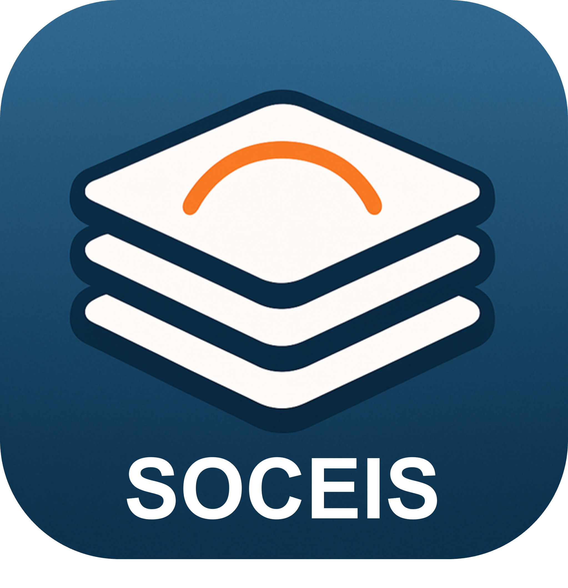
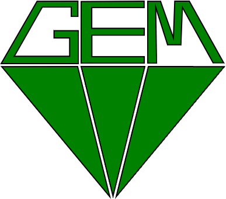
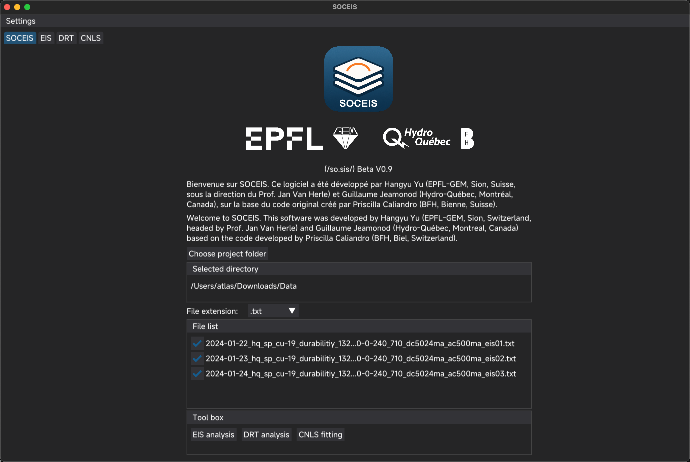
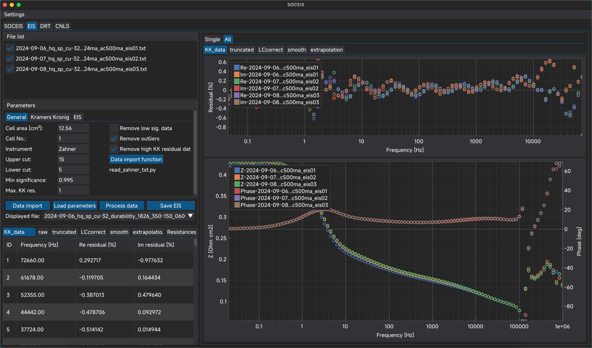
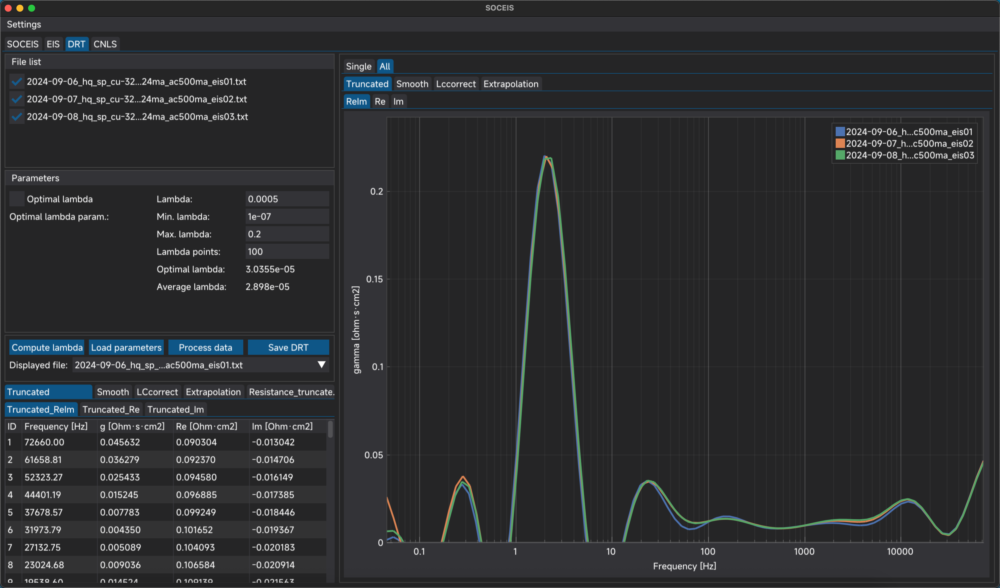
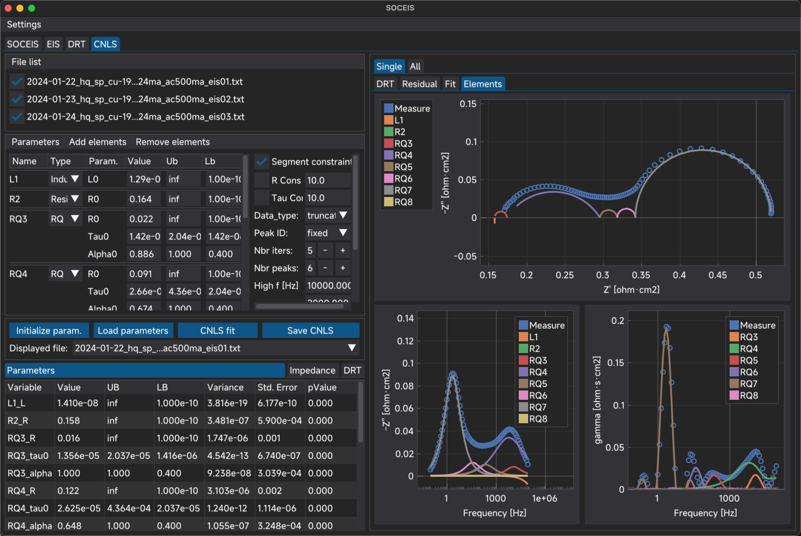

  

  
  
  
  

# SOCEIS - Electrochemical Impedance Spectroscopy Analysis Suite
Under development, more features up to come.

## Overview
**SOCEIS** is an advanced Python-based toolkit for comprehensive analysis of electrochemical impedance spectroscopy (EIS) data, developed by **Hangyu Yu** (EPFL-GEM, Sion, Switzerland, headed by **Prof. Jan Van Herle**) and **Guillaume Jeamonod** (Hydro-Québec, Montreal, Canada) based on the code developed by **Priscilla Caliandro** (BFH, Biel, Switzerland).. The software integrates three core methodologies:

1. **Distribution of Relaxation Time (DRT)** - Tikhonov-regularized deconvolution
2. **Equivalent Circuit Modeling (ECM)** - Flexible circuit topology builder with constraint management
3. **Complex Nonlinear Least Squares (CNLS) Fitting** - Advanced optimization with:
   - Bounded parameter constraints (R, τ, α, etc.)
   - Adjustable parameter constraints

## Key Features
### ▸ Experimental Workflow Integration
- Batch processing with ECM constraints adjustment
- Intuitive results illustration with individual measruement analysis and multiple data analysis
- Native support for Zahner `.txt`/`.csv` files and BioLogic `.mpt` formats

## Technical Specifications
### System Requirements
- Python 3.8+ (64-bit)

### Dependencies
| Package | Version | Purpose |
|---------|---------|---------|
| NumPy | ≥1.20 | Core numerical operations |
| SciPy | ≥1.7 | Optimization & signal processing |
| Pandas | ≥1.3 | Data structure management |
| Matplotlib | ≥3.5 | Publication-quality visualization |
| DearPyGui | ≥1.7 | GPU-accelerated UI framework |
| OpenPyXL | ≥3.0 | Excel report generation |

  
  
  
  

# Major updates
## ---------- Date: 2025.05.07 ----------
Beta version 0.2 with complete EIS, DRT and CNLS fit functionalities. Small bugs to be fixed
### To do list
- [ ] If CNLS fit results are not completely saved, error.
- [ ] Pop-up window to indicate the fault operation
- [ ] Simply the batch process name with ID+number-file_name
- [ ] Pop-up progress bar for the saving, processing
- [ ] Modularized code design
- [ ] Delete only the curves instead of the whole tab
- [ ] Add functions
	- [ ] Add Warburg element for Li-BAT
  - [ ] Peak finder for quick frequency selection
  - [ ] Plot lambda in DRT
  - [ ] Plot ohmic resistance and polarization resistance trend in EIS and DRT tabs
	- [ ] Interactive manual selected points for CNLS fit frequency determine
	- [ ] Visualized equivalent circuit model assembly and usage of only basic circuit component R, C, L, Q, fFLW, FLW, G, etc.
	- [ ] Z-HIT smoothing from Zahner
	- [ ] Different DRT methodologies
	- [ ] Image save
## ---------- Date: 2025.02.12 ----------
### To do list
- [x] Translate all the codes in Matlab environment into python code
	- [x] Check the results between the matlab environment and python environment 
- [x] Define the best HMI tool in python with open-access